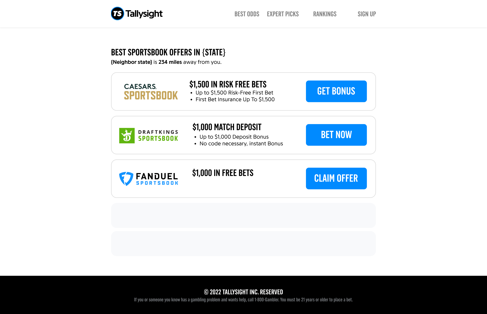

# Tallysight Coding Exercise

## Setup

- Clone this repo and create a new branch.
- Create [Next.js](https://nextjs.org/) project with Typescript.
  - Get familiar with Static Generation, Server-Side Rendering, and API Routes.
  - Do not change contents of `tsconfig.json` and `.eslintrc.json`.
- Install [ChakraUI](https://chakra-ui.com/).
  - We'll use ChakraUI for all UI elements. Please get familiar with it:
    - https://chakra-ui.com/docs/components/overview
    - https://pro.chakra-ui.com/components/free
- Install and configure any dev dependency you usually use (e.g. `prettier`, `lint-staged`, etc.)

## Design



## Tasks

```
- Please read all tasks before you start.
- Complete tasks in order.
- Do not skip tasks unless you get stuck.
```

### 1. Geolocation _(data coming from SSR)_

- Use [ipinfo.io](https://ipinfo.io/) free account to obtain the visitor's state.
- **Do not use** their client library, use native functions already available with the [current Setup](#setup).
- Show the visitor's state as shown in the design. _`{STATE}`_

### 2. Neighbor State _(data coming from an API Route)_

- Using [states.json](states.json), find nearest state to the visitor's state that was provided by [Geolocation.](#2-geolocation-coming-from-ssr)
  ```
  Tip: Haversine formula.
  ```
- Read from the file somehow, not copy/paste.
- Show nearest state and the distance as shown in the design. _`{Neighbor state}`_
- Bonus: show a loading spinner while fetching the data (you may want to add an artificial delay of 1 second).

### 3. List of offers _(data coming from SSR)_

- Implement list of offers from the design.

  ```
  Tip: VStack and HStacks.
  ```

- Fetch list of offers from [this endpoint](https://api.airtable.com/v0/appDFOzemd24MG2CZ/sportsbooks) using bearer token `keyv05VZXGSFfVKO4`.
- Use `URL` (from API response) for the blue buttons.

### 4. Navigation Bar

- Use [this logo](https://tallysight.com/ts-logo.png).
- Use empty pages for the navigation links.

### 5. Footer

- Dynamic year.

### Optional

- If you still have enough time and want to go beyond, please feel free to add anything you think this page could benefit from or anything you feel would showcase your skills.

---

## Notes

- Store token in an environment variable and secured from public access.
- Include the environment file so we can easily run your project.
- Always keep accessibility and responsiveness in mind for every UI element.
- Use the [current Setup](#setup) without installing any extra packages, unless it's a package you think you need to make progress.
